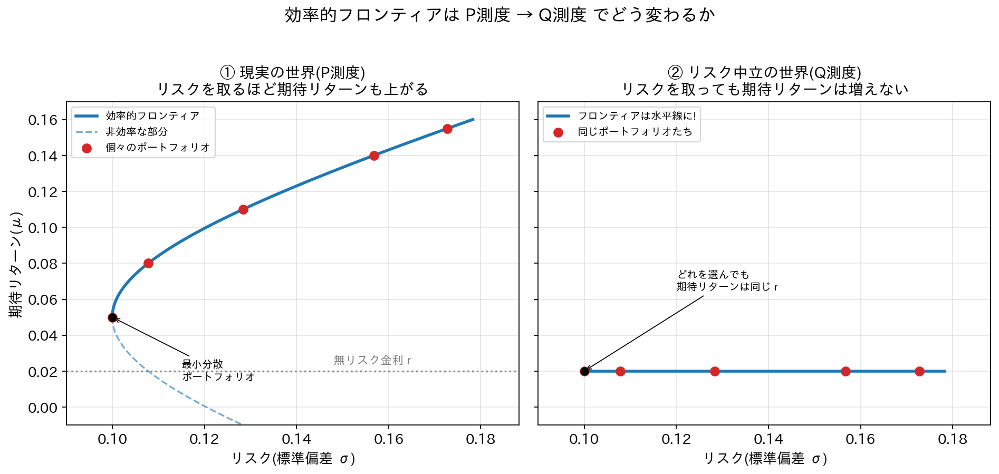

# リスク中立測度のもとで、効率的フロンティアの形はどう変わる?

## 1. まず「効率的フロンティア」を思い出そう

第2章では、いろいろな資産を組み合わせた「ポートフォリオ」を考え、横軸に**リスク(リターンのブレの大きさ、標準偏差σ)**、縦軸に**期待リターン(平均的にどれだけ儲かりそうか、μ)**をとってグラフに点を打ちました。

その点たちの一番「お得な」境界線(同じリスクならリターンは最大、同じリターンならリスクは最小、という組み合わせを結んだ線)が**効率的フロンティア**です。これは右上がりに弓なりにカーブする曲線になります。

なぜ右上がりになるのか?それは、ふつうの人(現実世界の投資家)は「リスクが嫌い」だからです。リスクの高い資産を買ってもらうには、その分「ご褒美」として高い期待リターンを用意してあげないと誰も買ってくれません。これを**リスクプレミアム**と呼びます。リスクを取れば取るほど、ご褒美(期待リターン)も大きくなる――これが効率的フロンティアが右上がりにカーブする理由です。

ここで使っている「みんなが実際にどう考え、どんな確率で物事が起こると思っているか」という現実の確率の世界を、**P測度**と呼びます。

## 2. リスク中立測度(Q測度)って何?

**リスク中立測度(Q測度)**は、現実の世界とはまったく別の「計算専用の仮想世界」です。オプションなどの金融商品の価格を、誰の好み(リスクが好きか嫌いか)にも左右されずに公平に求めるための"道具"として作られた確率の測り方です。

イメージしやすいたとえを使うと――

> サイコロの出る目の確率を、実際のサイコロの確率(1〜6が同じ1/6)とは違う「計算用の重み付け」にこっそり付け替えて計算する。実際のサイコロが変わったわけではなく、計算がうまくいくように確率の"目盛り"だけ付け替えている。

これと同じように、Q測度では「すべての資産が、リスクの大小にかかわらず、平均的には無リスク金利(銀行预金の金利のようなもの)と同じだけ成長する」ように、確率の重み付けを人工的に調整します。つまり**リスクを取ったご褒美(リスクプレミアム)を、計算上ゼロにしてしまう**測度なのです。

これは「人々が本当にリスクに無関心になった」という意味ではありません。あくまで価格を矛盾なく(アービトラージ=濡れ手に粟の手品が起きないように)計算するための数学的なトリックです。

## 3. では効率的フロンティアはどうなる?

ここがこの章の一番大事なポイントです。

P測度では、リスクの大きい資産ほど期待リターンμも大きくなりました。しかしQ測度では、**どんなポートフォリオを作っても、期待リターンは全部「無リスク金利 r」と同じ値になります**。リスクをいくら背負っても、リターンの「ご褒美」は1円も増えないのです。

一方で、リスクの大きさ(標準偏差σ、グラフの横軸)そのものは、P測度のときとほとんど変わりません。測度を変えるという操作は、「平均的にどれだけ儲かると期待するか」という見込み(専門的には"ドリフト"と言います)だけを動かす操作で、「どれだけ上下にブレるか」という揺れ幅(ボラティリティ)には影響しないからです。

結果として何が起きるかというと――

**第2章で見た右上がりの曲線(効率的フロンティア)が、まっ平らな水平線(高さ = 無リスク金利 r)に潰れてしまう**のです。

リスクという横軸の広がりはそのままなのに、縦軸(期待リターン)だけが全部同じ高さrに揃ってしまう。曲線がペタンと寝てしまうイメージです。

さらに突き詰めると、この水平線上ではどの点も期待リターンが同じrなので、「賢い選び方」をするなら、リスクが一番小さい点(最小分散ポートフォリオ)を選ぶのが当然です。リスクを増やしても見返りはゼロなのですから、リスクを余分に取るだけ損です。つまりQ測度の世界では、「効率的な選択」は実質的にたった1点に潰れてしまう、とも言えます。

## 4. 図で比べてみよう

左の図(①現実の世界=P測度)では、赤い点(いろいろなポートフォリオ)が右上がりの曲線に沿って並んでいます。リスクを取るほど期待リターンも高くなっていますね。

右の図(②リスク中立の世界=Q測度)では、同じ赤い点(横軸のリスクの値は左図と同じ)が、すべて無リスク金利 r の高さの水平線上に並び直しています。リスクの大きさはバラバラなのに、期待リターンは全員同じというわけです。

## 5. なぜこんな変な世界を考えるの?

「リスクを取っても得しない」なんて、実際の投資の話としては変ですよね。その通りで、Q測度は**実際にポートフォリオを選ぶための道具ではありません**。

Q測度が役に立つのは、オプションなどの**金融派生商品の「公正な価格」を計算する**場面です。ブラック・ショールズ・モデルなどの価格づけの理論では、「将来もらえるお金を、Q測度のもとで期待値を取り、それを無リスク金利で現在の価値に割り戻す」という方法で価格を求めます。Q測度を使うことで、各投資家がリスクをどれくらい嫌っているか(リスク選好)を一切知らなくても、矛盾のない(アービトラージが生まれない)価格を計算できる、というのがこの仮想世界の最大のメリットです。

## 6. まとめ

| | P測度(現実の世界) | Q測度(リスク中立の世界) |
|---|---|---|
| 効率的フロンティアの形 | 右上がりの弓なりの曲線 | 高さrの水平線(実質1点に潰れる) |
| リスク(σ) | 資産ごとに異なる | 変わらない(そのまま) |
| 期待リターン(μ) | リスクが大きいほど高い | 全資産で無リスク金利rに統一 |
| 何のための世界か | 実際の投資判断・ポートフォリオ選び | 派生商品の公正な価格づけのための計算上の道具 |

リスク中立測度に切り替えると、「リスクを取れば取るほど得をする」という現実世界の当たり前の関係が消えてしまい、効率的フロンティアという"右肩上がりの夢"は、ただの水平線になってしまう――これが今回のポイントです。
