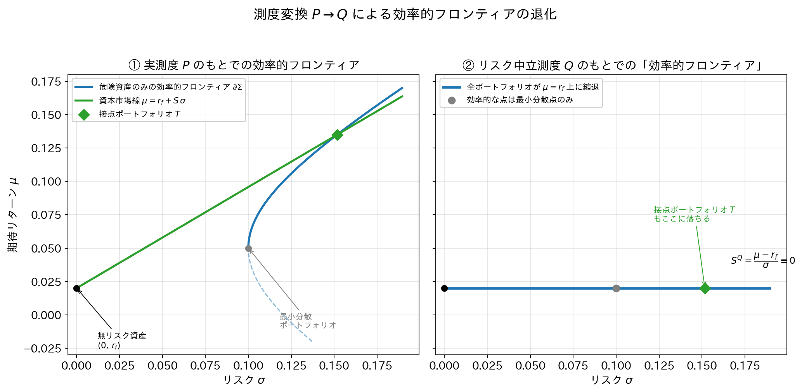

# リスク中立測度のもとでの効率的フロンティアの退化

### ― 測度変換 $P \to Q$ が平均・分散フロンティアに与える影響 ―

---

## 1. 問題設定と記法

危険資産が $n$ 個存在する1期間モデルを考える。確率空間 $(\Omega, \mathcal{F}, P)$ 上で、各資産 $i$ の(単純)リターンを確率変数 $R_i$ とし、

$$
\mathbf{R} = (R_1, \dots, R_n)^\top, \qquad
\boldsymbol{\mu}^P = E^P[\mathbf{R}], \qquad
\Sigma = \mathrm{Cov}^P(\mathbf{R})
$$

と定義する。ただし $\Sigma$ は正定値であるとする。さらに無リスク資産が存在し、その総収益率(グロスリターン)を $r_f$ とする。

ポートフォリオはウェイトベクトル $\mathbf{w} \in \mathbb{R}^n$ によって特徴づけられ、危険資産部分のウェイト和を $\mathbf{w}^\top \mathbf{1}$、無リスク資産のウェイトを $1 - \mathbf{w}^\top \mathbf{1}$ とする。ポートフォリオのリターンは

$$
R_p = (1 - \mathbf{w}^\top \mathbf{1})\, r_f + \mathbf{w}^\top \mathbf{R}
$$

であり、その期待値と分散は

$$
\mu_p = r_f + \mathbf{w}^\top(\boldsymbol{\mu}^P - r_f \mathbf{1}), \qquad
\sigma_p^2 = \mathbf{w}^\top \Sigma\, \mathbf{w}
$$

で与えられる。

---

## 2. 命題1(復習):$P$測度のもとでの効率的フロンティア

**Markowitz問題**は次のように定式化される。

$$
\min_{\mathbf{w}} \ \tfrac{1}{2}\mathbf{w}^\top \Sigma \mathbf{w}
\quad \text{s.t.} \quad
\mathbf{w}^\top \boldsymbol{\mu}^P = \mu_p, \quad \mathbf{1}^\top \mathbf{w} = 1
$$

ラグランジュ未定乗数法によりこれを解くと、危険資産のみの効率的フロンティアは $(\sigma_p, \mu_p)$ 平面において双曲線

$$
\sigma_p^2 = \frac{a\,\mu_p^2 - 2b\,\mu_p + c}{ac - b^2}, \qquad
a = \mathbf{1}^\top \Sigma^{-1} \mathbf{1}, \quad
b = \mathbf{1}^\top \Sigma^{-1} \boldsymbol{\mu}^P, \quad
c = (\boldsymbol{\mu}^P)^\top \Sigma^{-1} \boldsymbol{\mu}^P
$$

の上半分として与えられる。

無リスク資産を導入した二基金分離定理(Tobin separation)のもとでは、フロンティアは原点 $(0, r_f)$ から接点ポートフォリオ $T$ を通る直線、すなわち**資本市場線(CML)**

$$
\mu_p = r_f + S \cdot \sigma_p, \qquad
S \;=\; \frac{\mu_T - r_f}{\sigma_T} \;=\; \sqrt{(\boldsymbol{\mu}^P - r_f\mathbf{1})^\top \Sigma^{-1} (\boldsymbol{\mu}^P - r_f\mathbf{1})}
$$

に退化する。ここで $S$ は接点ポートフォリオのシャープレシオであり、$S>0$ である限りCMLは正の傾きを持つ右上がりの直線となる。これが第2章で確認した効率的フロンティアである。

---

## 3. リスク中立測度 $Q$ の定義

資産価格付け理論における**リスク中立測度(同値マルチンゲール測度)** $Q$ とは、$P$ と同値な確率測度($P \sim Q$、すなわち零集合を共有する測度)であって、無リスク資産を numéraire(基準財)とした各資産の割引価格過程

$$
\widetilde{S}_i(t) = \frac{S_i(t)}{B(t)}, \qquad B(t) = (1+r_f)^t
$$

が $Q$ のもとでマルチンゲールとなるもの、すなわち

$$
E^Q\!\left[\widetilde{S}_i(T) \mid \mathcal{F}_t\right] = \widetilde{S}_i(t) \qquad \forall i
$$

を満たす測度として定義される。**資産価格づけの基本定理(Fundamental Theorem of Asset Pricing)**により、このような $Q$ が(少なくとも1つ)存在することと市場が無裁定であることは同値である。

この定義を1期間モデルでのリターンに翻訳すると、直ちに次が得られる。

$$
E^Q[R_i] = r_f \qquad \text{for all } i = 1, \dots, n
\tag{3.1}
$$

すなわち $Q$ のもとでは、**すべての危険資産の期待リターンが無リスク金利に一致する**。これがリスク中立測度の核心的な性質である。

---

## 4. 測度変換が1次・2次モーメントに与える影響

ここで重要なのは、$P \to Q$ という測度変換が**何を変え、何を変えないか**を正確に区別することである。

**(i) 1次モーメント(ドリフト)は変化する。**
(3.1)により、$\boldsymbol{\mu}^Q := E^Q[\mathbf{R}] = r_f \mathbf{1}$ となり、$\boldsymbol{\mu}^P$ から $\boldsymbol{\mu}^Q$ へと変化する。

**(ii) 2次モーメント(共分散構造)は変化しない。**
$P$ と $Q$ が同値測度であり(Girsanov型の定理、連続時間ではGirsanovの定理そのもの)、測度変換はRadon-Nikodym微分

$$
\left.\frac{dQ}{dP}\right|_{\mathcal{F}_T} = Z_T
$$

による確率測度の「重み付け替え」にすぎないため、確率変数 $\mathbf{R}$ の**実現値そのもの(標本路)は変わらない**。連続時間モデルでは二次変分(quadratic variation)が測度変換に対して不変であることがGirsanovの定理から従い、離散モデルにおいても共分散構造 $\Sigma$ は測度変換の影響を受けないとして扱うのが標準的である。したがって

$$
\mathrm{Cov}^Q(\mathbf{R}) = \Sigma \quad (\text{$P$ のもとでの共分散と同一})
\tag{4.1}
$$

が成り立つ。

まとめると、測度変換 $P \to Q$ は**「リスクプレミアムだけを消去し、リスクの大きさ自体には触れない」**という操作である。

---

## 5. 定理:$Q$測度下での効率的フロンティアの退化

**定理.** 危険資産ウェイト $\mathbf{w}$($\mathbf{1}^\top \mathbf{w} = 1$)で構成される任意のポートフォリオについて、$Q$ のもとでの期待リターンは

$$
\mu_p^Q = \mathbf{w}^\top \boldsymbol{\mu}^Q = \mathbf{w}^\top (r_f \mathbf{1}) = r_f (\mathbf{w}^\top \mathbf{1}) = r_f
\tag{5.1}
$$

であり、$\mathbf{w}$ の選び方に依らず常に $r_f$ に等しい。一方、ポートフォリオの分散は (4.1) より

$$
(\sigma_p^Q)^2 = \mathbf{w}^\top \Sigma\, \mathbf{w}
$$

であって $P$ のもとでの分散と同一の関数形を持つ。

**系1(フロンティアの退化).** $(\sigma_p, \mu_p)$ 平面における実行可能集合(opportunity set)は、$Q$ のもとでは半直線

$$
\left\{ (\sigma_p^Q,\, r_f) \;:\; \sigma_p^Q \ge \sigma_{\mathrm{MVP}} \right\}, \qquad
\sigma_{\mathrm{MVP}} = \frac{1}{\sqrt{\mathbf{1}^\top \Sigma^{-1} \mathbf{1}}}
$$

に縮退する。すなわち、$P$ のもとで双曲線(または無リスク資産込みでは右上がりのCML)であった効率的フロンティアは、$Q$ のもとでは**高さ $r_f$ の水平線**に潰れる。

**系2(シャープレシオの消滅).** 任意のポートフォリオについて、$Q$ のもとでのシャープレシオは

$$
S^Q = \frac{\mu_p^Q - r_f}{\sigma_p^Q} = \frac{r_f - r_f}{\sigma_p^Q} = 0
$$

恒等的にゼロとなる。特に、$P$ のもとで正のシャープレシオ $S>0$ を持っていた接点ポートフォリオ $T$ も、$Q$ のもとでは $S^Q_T = 0$ となる。

**系3(効率的選択の自明化).** $\mu_p^Q \equiv r_f$ がウェイトに依らず一定であるから、平均・分散基準のもとでの「効率的」な点とは、この制約下で分散を最小化する点、すなわち**最小分散ポートフォリオ(MVP)ただ1点**に縮退する。それ以外の実行可能な点(MVPより右側の半直線上の点)はすべて「同じ期待リターンでより大きなリスクを負う」非効率な点となる。

*証明.* (5.1) は線形性から直ちに従う。系1〜3はいずれも (5.1) と (4.1) の系である。$\blacksquare$

---

## 6. 図解

下図は、同一のリスク資産集合(同一の $\Sigma$)に対して、測度を $P$ から $Q$ へ切り替えたときの効率的フロンティアの変化を示したものである。横軸 $\sigma$(リスク)の値は左右で完全に対応しており、変化しているのは縦軸 $\mu$(期待リターン)のみであることに注意されたい。

左図(① $P$測度)では、双曲線型の効率的フロンティアと、傾き $S>0$ のCMLが描かれている。接点ポートフォリオ $T$ はCML上でリスク資産フロンティアに接する点である。

右図(② $Q$測度)では、同じ $\sigma$ の値を持つすべての点が、高さ $\mu=r_f$ の水平線上に「押しつぶされて」並んでいる。CMLの傾き(シャープレシオ)はゼロになり、接点ポートフォリオ $T$ もこの水平線上の一点に落ちる。

---

## 7. 経済学的含意

1. **リスク中立測度はリスク選好を中立化する計算上の構成物である。** 現実の投資家がリスク回避的であるという事実([系1]崩壊前の右上がりのフロンティア)が消えるわけではない。$Q$ はあくまで価格づけのための仮想的な確率測度であり、実際のポートフォリオ選択の基準ではない。

2. **無裁定条件との整合性。** (3.1) は本質的に「無裁定のもとでは、リスクを調整した(risk-adjusted)期待リターンはすべての資産で等しくなければならない」という命題の言い換えである。$Q$ のもとでこの調整後の期待リターンが一律 $r_f$ になることは、まさに無裁定性の数学的表現に他ならない。

3. **デリバティブ価格づけへの応用。** この性質こそが、Black–Scholesモデルをはじめとするリスク中立評価法の基盤である。原資産のドリフトを(現実の $\mu$ ではなく)$r_f$ に置き換えて期待値を計算し、それを無リスク金利で割り引くことで、各投資家のリスク選好に関する仮定なしに、無裁定価格を一意に求めることができる。

4. **$P$ と $Q$ の使い分け。** ポートフォリオ理論(第2章の効率的フロンティア、CAPM等)は本質的に $P$測度の理論であり、投資家の期待効用最大化問題に立脚する。これに対しデリバティブの相対価格づけ理論は $Q$測度の理論であり、両者は「同じ資産集合」を扱いながら、目的に応じて異なる確率測度を用いる、車の両輪の関係にある。

---

## 8. まとめ

| | $P$測度(実測度) | $Q$測度(リスク中立測度) |
|---|---|---|
| 期待リターンベクトル | $\boldsymbol{\mu}^P$(資産ごとに異なる) | $\boldsymbol{\mu}^Q = r_f \mathbf{1}$(全資産で一定) |
| 共分散構造 | $\Sigma$ | $\Sigma$(不変) |
| 効率的フロンティアの形状 | 双曲線 / CML(右上がりの直線) | 水平線 $\mu = r_f$ への退化 |
| シャープレシオ | $S>0$(接点ポートフォリオで最大) | $S^Q \equiv 0$(恒等的にゼロ) |
| 効率的な点の集合 | フロンティア上の連続濃度の点 | 最小分散ポートフォリオ1点に縮退 |
| 理論的役割 | ポートフォリオ選択・資産配分 | 無裁定価格づけ(デリバティブ評価) |

測度変換 $P \to Q$ は、リターンの確率分布における**ドリフトのみを再調整し、ボラティリティ構造を保存する**操作である。この性質により、効率的フロンティアという「リスクを取ることの見返り」を表現する幾何学的対象は、$Q$ のもとでは情報量を失い、ただ1本の水平線(実質的には1点)に縮退する。
